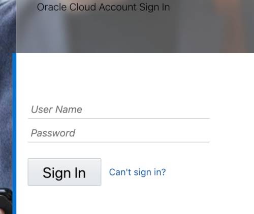
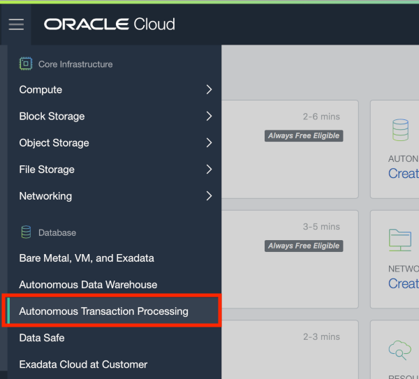
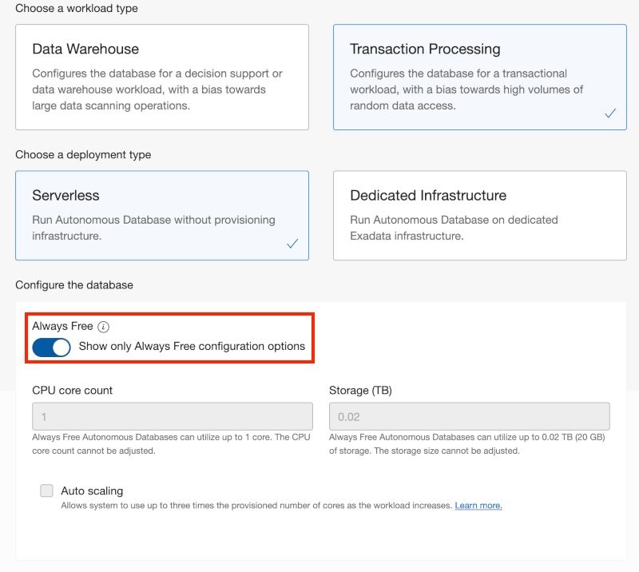
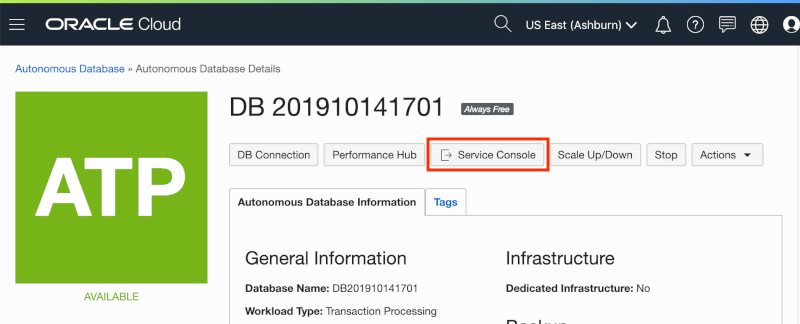
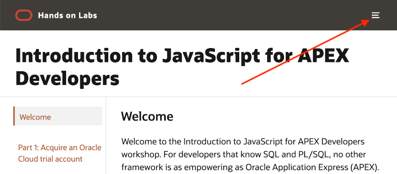
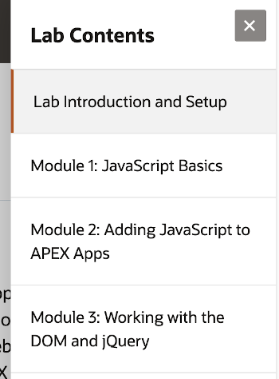

# Introduction to JavaScript for APEX Developers

## Lab overview

Welcome to the Introduction to JavaScript for APEX Developers hands-on lab. For developers that know SQL and PL/SQL, no other framework is as empowering as Oracle Application Express (APEX). But at the end of the day, APEX creates web apps, and it's JavaScript that programs the web. Over the years, JavaScript's role in APEX apps has increased, both for the creators of APEX and the developers using it - a trend that will continue in the years to come.

APEX developers only need to know a little bit of JavaScript to have a significant impact, and that's what this hands-on lab is all about! You'll start by learning some of the basics of JavaScript, then learn how to add JavaScript to APEX apps, and finally, you'll learn to use jQuery to work with the DOM.

**Lab Objectives**

* Learn the basics of JavaScript using PL/SQL as a guide
* Learn how to add JavaScript to an APEX app
* Get experience working with the jQuery and DOM

**Lab Modules**

| # | Module | Est. Time |
| --- | --- | --- |
| 1 | [JavaScript Basics](?module=javascript-basics) | 60 min |
| 2 | [Adding JavaScript to APEX Apps](?module=adding-javascript-to-apex-apps) | 60 min |
| 3 | [Working with jQuery and the DOM](?module=working-with-the-dom-and-jquery) | 60 min |

## **Part 1**: Acquire an Oracle Cloud trial account

In this part, you will sign up for an Oracle Cloud trial account. Trial accounts have access to the [free tier services](https://www.oracle.com/cloud/free/) and get a $300 credit for other services. This lab only requires an APEX Workspace, which is available via the free tier services and will continue to work when the credits expire (after 30 days). Use the credits as you wish to explore other parts of the Oracle Cloud.

1.  If you already have an Oracle Cloud trial account (or regular account), you may skip to the next part.

2.  Please <a href="https://myservices.us.oraclecloud.com/mycloud/signup?language=en&sourceType=:ow:lp:mt::RC_NAMK190904P00063:SodaNodeJson&intcmp=:ow:lp:mt::RC_NAMK190904P00063:SodaNodeJson" target="_trial_">click this link to create your free account</a>. 

3.  Soon after requesting your account you will receive the following email. Once you receive this email you may proceed to Part 2.

    

## **Part 2:** Log in to your Oracle Cloud account

In this part, you will log into your Oracle Cloud account so that you can start working with various services.

1.  Once you receive the **Get Started Now with Oracle Cloud** email, make note of your **Username**, **Password**, and **Cloud Account Name**.

2.  From any browser go to [https://cloud.oracle.com/en_US/sign-in](https://cloud.oracle.com/en_US/sign-in).

3.  Enter your **Cloud Account Name** in the input field and click the **Next** button.

    

4.  Enter your **Username** and **Password** in the input fields and click **Sign In**.

    

## **Part 3:** Create an Autonomous Transaction Processing instance

In this part, you will create an instance of the Autonomous Transaction Processing database service.

1.  From the Cloud Dashboard, click the navigation menu icon in the upper left-hand corner and then select **Autonomous Transaction Processing**.

    

2.  Click **Create Autonomous Database**.

    

3.  Select the **Always Free** option, enter **`SecretPassw0rd`** for the ADMIN password, then click **Create Autonomous Database**. Note: you may choose a different password, just be sure to make note of it and substitute it any time there's a reference to **`SecretPassw0rd`**.

    
    
    

    After clicking **Create Autonomous Database**, you will be redirected to the Autonomous Database Details page for the new instance. Continue to the next part when the status changes from:

     

    to:

    

## **Part 4:** Create a new workspace in APEX

When you first access APEX you will need to log in as an APEX instance administrator to create a workspace. A workspace is a logical domain where you define APEX applications. Each workspace is associated with one or more database schemas (database users) which are used to store the database objects, such as tables, views, packages, and more. These database objects are generally what APEX applications are built on top of.

1.  Click the **Service Console** button.

    

2.  Click **Development** option in the menu on the left, then click the **Oracle APEX** option.

    

3.  Enter the password for the Administration Services and click **Sign In to Administration**. The password is the same as the one entered for the ADMIN user when creating the ATP instance: **`SecretPassw0rd`**

    

4.  Click **Create Workspace**.
  
   

5.  Enter the following details and click **Create Workspace**.

    | Property | Value |
    | --- | --- |
    | Database User | **DEMO** |
    | Password | **`SecretPassw0rd`** |
    | Workspace Name | **DEMO** |
  
    

6.  Click the **DEMO** link in the success message. This will log you out of APEX administration so that you can log into your new workspace. 
	
    

7.  Enter **`SecretPassw0rd`** for the password, check the **Remember workspace and username** checkbox, and then click **Sign In**.

    

## **Part 5**: Navigate to Module 1

1.  [Click here](?module=javascript-basics) to navigate to Module 1. Alternatively, you can click the navigation menu icon in the upper-left corner of the browser window to see a list of modules in the lab.

    

2. Click **Module 1: Create an ATP instance**.
  
    