# Module 2: Adding JavaScript to APEX Apps

## Introduction

Up to this point, you have been working with JavaScript outside of APEX. In this module, you will learn the most common ways to add JavaScript to APEX applications. The options include Dynamic Actions, Dynamic Actions with JavaScript hooks, page- and component-level attributes, and application files. 

Think of these options as a progression, with each one requiring more knowledge of JavaScript, APEX’s JavaScript APIs, and web development in general. New APEX developers should start by learning Dynamic Actions and progress to subsequent options only when they are ready *and* the application requirements cannot be satisfied without a more advanced approach.

Generally speaking, the more declarative the solution, the easier it will be to implement and maintain. 

***To log issues***, click here to go to the [github oracle](https://github.com/oracle/learning-library/issues/new) repository issue submission form.

## Module 2 Objectives

- Learn how to create a basic Dynamic Action
- Utilize JavaScript hooks within the Dynamic Action framework
- Learn how to create and execute functions

## Parts

### **Part 1:** Using Dynamic Actions

Dynamic Actions are the easiest way to add JavaScript to an application in APEX. Often times, they can be completely declarative (no code needed). In this part, you will create a Dynamic Action that hides and shows page components based on the value of an item.

1.  Log in to your APEX Workspace. If you created the Workspace using the instructions in the introduction to this lab, then the **Workspace** and **Username** will be `DEMO` and the **Password** will be `SecretPassw0rd`.

    

2.  Navigate to the **App Gallery** and install the **Sample Database Application**.

    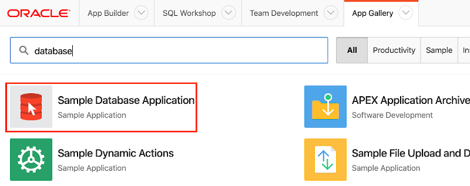

3.  Run the app and navigate to the **Products** page. Click the **Name** of a product, such as **Bag**. You should see a form like the following.

    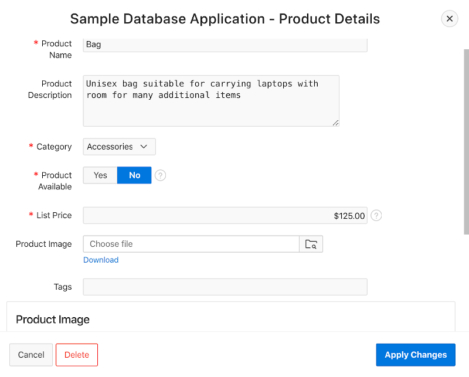

    At the moment, the **Product Image** item and the region that displays the image are both visible when the **Product Avaiable** item is set to **No**. In the subsequet steps, you will implement a Dynamic Action that hides the image item and related region when **Product Avaiable** item is set to **No**.

4.  Navigate to the Page Designer for page 6, the Product Details page, in the sample app. In the Rendering pane on the left, right-click the item named **P6_PRODUCT_AVAIL** and select **Create Dynamic Action**.

    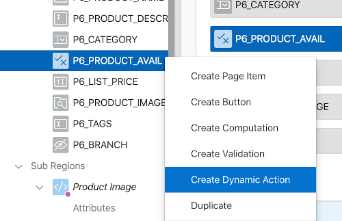

5.  In the properties pane on the right, set **Name** to **P6_PRODUCT_AVAIL changed**. Notice that the selections for **Event**, **Selection Type**, and **Item(s)** are all correct because the action was created by right-clicking **P6_PRODUCT_AVAIL**. Open the **Event** select list to view all of the other events available before continuing.

    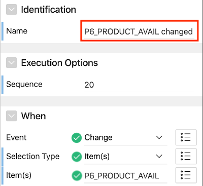

6.  To create the opportunity to have both true and false actions, you will need to define a client-side condition. In the **Client-side Condition** section, set **Type** to **Item = Value**, **Item** to **P6_PRODUCT_AVAIL** (should be the default), and **Value** to **Y**.

    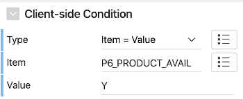

7.  Select the **Show** action in the left pane. This was the default action created, but it happens to be the one needed for the requirement.

    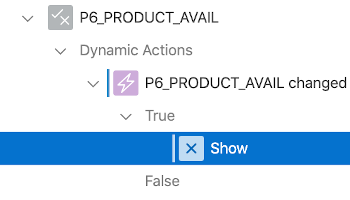

8.  In the right pane, set **Selection Type** to **Item(s)** and **Item(s)** to **P6_PRODUCT_IMAGE**.

    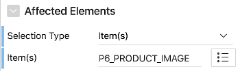

    This will ensure the image item is shown correctly, but you need to account for the region too. You'll do that next.

9.  Right-click the **Show** action in the left pane and select **Duplicate**. 

    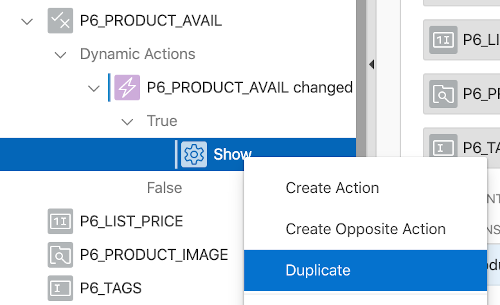

10. In the properties pane on the right, set **Selection Type** to **Region** and **Region** to **..Product Image**. 

    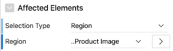

11. At this point, the Show actions are configured correctly but the Hide actions still need to be created. Since Hide is an opposite of Show, APEX makes this very easy. Select both Show actions in the left pane, then right-click either action and select **Create Opposite Action**.

    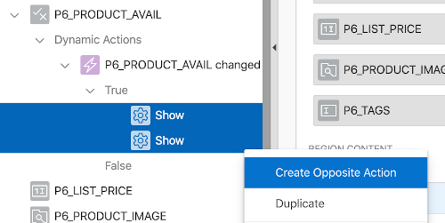

    You should see two new Hide actions appear under the False branch in the Dynamic Action. Best of all, they are already configured with the settings from the previous actions.

12. Save your changes and then return to the runtime application. Close the form page and reopen it by clicking on a product again. Now, the image item and region should be hidden or shown based on the value of **Product Available**. With Dynamic Actions, you can do all of that without writing a single line of JavaScript code!

    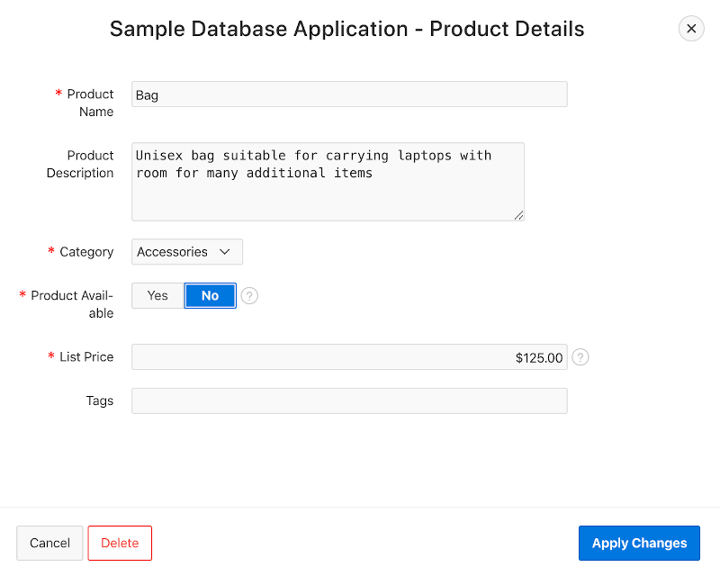
    
### **Part 2:** Using Dynamic Actions with JavaScript hooks

The Dynamic Action framework provides various JavaScript hooks, or features which are geared toward developers that know a little JavaScript. These features can make the framework much more powerful and flexible.

In this part, you will use these features in the Dynamic Action you created in the previous part. The end result will be the same, but you will have a better idea of the JavaScript hooks available to you when needed. 

1.  Return to the Page Designer for page 6 and select the Dynamic Action created in the previous part. 

    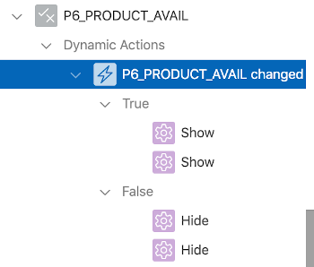

2.  In the **When** section of the right pane, set **Event** to **Custom**, **Custom Event** to **change**, **Selection Type** to **jQuery Selector**, and **jQuery Selector** to **#P6_PRODUCT_AVAIL**.

    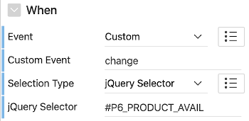

    These settings are the same as the declarative ones. You will learn more about events, jQuery, and jQuery selectors in the next module.

3.  In the **Client-side Condition** section, set **Type** to **JavaScript Expression** and **JavaScript Expression** to this code: `$v(this.triggeringElement.id) === 'Y'`

    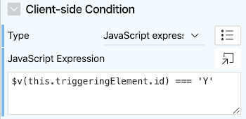

    `$v` is a function provided by the [JavaScript APIs for APEX](https://apex.oracle.com/jsapi). It returns the value of an item. The id property of the item is obtained dynamically so that if its name changes, the expression doesn't need to be updated.

4.  Before modifying the actions, you need to set a region property to provide a consistent id for a Product Image region. In the left pane, select the **Product Image** region.

    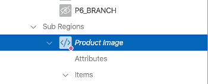

5.  In the right pane, set **Static ID** to **product-image-reg**.

    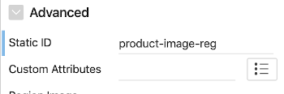

6.  In the left pane, select the **Dynamic Action** tab. This is required because the Dynamic Action is no longer linked directly to the item as it was when using the declarative selector.

    Right-click and **Delete** one of the **Show** actions. Then select the remaining **Show** action.

    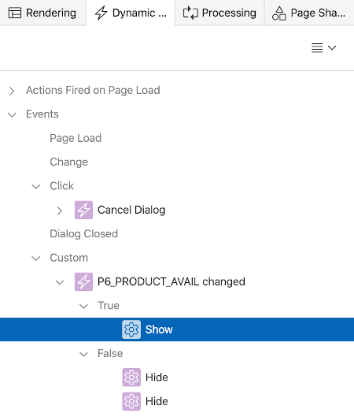

7.  In the right pane, set **Action** to **Execute JavaScript** and put the following code in the **Code** attribute.

    ```
    $('#product-image-reg').show();
    $('#P6_PRODUCT_IMAGE')
      .closest('.t-Form-fieldContainer')
      .show();
    ```

    That code uses DOM traversal and manipulation methods that will be explained in the next module. The action should appear as follows.

    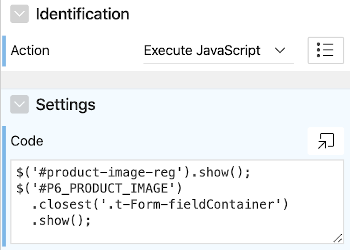

8.  Set the **Fire on Initialization** attribute to **Yes**.

    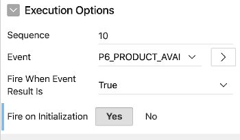

9.  In the left pane, select the **Dynamic Action** tab. Right-click and **Delete** one of the **Hide** actions. Then select the remaining **Hide** action.

    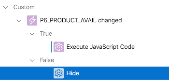

10. In the right pane, set **Action** to **Execute JavaScript** and put the following code in the **Code** attribute.

    ```
    $('#product-image-reg').hide();
    $('#P6_PRODUCT_IMAGE')
      .closest('.t-Form-fieldContainer')
      .hide();
    ```

    The action should appear as follows.

    

11. Set the **Fire on Initialization** attribute to **Yes**.

    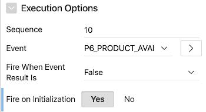

12. Save your changes and re-open the form page. Everything should work exactly as before. Hopefully you'll agree that the declarative options are much simpler than using the JavaScript hooks. However, when you need the flexibility they provide, you'll be glad the hooks are there!

### **Part 3:** Using Page and Component level attributes

In addition to Dynamic Actions, there are various attributes at the page and component level that are made for JavaScript. In this part, you'll learn where those attributes are and how they are used.

1.  Return to the Page Designer for page 1, the home page, and select the root element in the tree under the rendering tab. 

    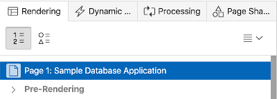

2.  In the right pane, scroll down through the properties until you find the **JavaScript** section. Put the following function in the **Function and Global Variable Declaration** property.

    ```
    function doWork() {
      console.log('doWork fired!');
    }
    ```

    The code in that property executes in the global scope - before the DOM load event and APEX components are initialized. 

    Next, add this code to the **Execute when Page Loads** property: `doWork();`

    Code in that property executes in a function scope - after the DOM load event and APEX components have been initialized.

    The settings should look as follows.

    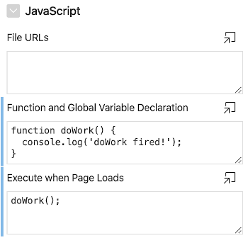

3.  Save your changes and run the home page with the browser console open. You should see a message when the `doWork` function is invoked. While this simple example doesn't do anything functional, you'll learn more about the types of things you can do in the next module.

4.  Navigate to **Reports** > **Sales by Category**. Currently, colors assigned to categories in the chart are randomly selected. You will add JavaScript code that explicitly sets the colors to different shades of green.

5.  Navigate to the Page Designer for page 16 and drill down on the **Attributes** of the **Sales by Category** region. Scroll down through the properties until you come to **JavaScript Initialization Code**, then copy the following function to that field.

    ```
    function(options) {
      options.dataFilter = function(data) {
        data.series[0].color = '#0B6623';
        data.series[1].color = '#9DC183';
        data.series[2].color = '#708238';
        
        return data;
      };
      
      return options;
    }
    ```

    This annonymous function accepts an options object and modifies it by adding a `dataFilter` function. The `dataFilter` function gives each series in the chart an explict color.

6.  Save you changes and rerun the page. You should see the same chart but with green colors now.

### **Part 4:** Using Static Files

In the last part, you added JavaScript code directly to page and component level attributes. For performance and reusability reasons, it can be beneficial to move JavaScript code to Static Files instead. While you don't have enough JavaScript code in the Sample Database Application to realize those benefits, in this part you'll move the code added previously to Static Files to see how it's done.

1.  The following code contains the `doWork` function that's being invoked on the home page and the function that's styling the colors of the Sales by Category chart. The only change to the second function is that it now has a name (it was an anonymous function before). Save the code in a new file on your computer named **sample-db-app.js**.

    ```
    function doWork() {
      console.log('doWork fired!');
    }
    
    function styleSalesByCatChart(options) {
      options.dataFilter = function(data) {
        data.series[0].color = '#0B6623';
        data.series[1].color = '#9DC183';
        data.series[2].color = '#708238';
        
        return data;
      };
      
      return options;
    }
    ```

2.  Navigate to the **Shared Components** > **Static Application Files**. Click **Upload File**, use the **File(s)** item to pick the **sample-db-app.js** file created in the previous step, and then click **Upload**. Note the string in the **Reference** column for the newly uploaded file: **#APP_IMAGES#sample-db-app.js**. You will make use of that in the proceeding steps.

3.  Navigate to the Page Designer for page 16 and drill down on the **Attributes** of the **Sales by Category** region. Replace the value in **JavaScript Initialization Code** with just: `styleSalesByCatChart`

    Note that the function does not have parenthesis on the end. That makes it a reference to the function declared in the file rather than an invocation of the function. APEX will invoke the function at the appropriate time.

4.  Select the page level attributes (root node under the rendering tab) and put the following file reference in the **File URL(s)** item in the **JavaScript** section: **#APP_IMAGES#sample-db-app.js**

5.  Save your changes and run the page. The chart should be styled with shades of green as before, only now the responsible JavaScript is defined in the static file. If the function were generic enough, it could be used elsewhere in the application.

6.  Navigate to the Page Designer for page 1 and drill down on the page level attributes. Clear the value in the **Function and Global Variable Declaration** field and add the following file reference in the File URL(s) item in the JavaScript section: **#APP_IMAGES#sample-db-app.js**

7.  Save your changes and run the page. You should see the same message from the `doWork` function as before, only now the function is defined in the static file.

## Summary

This completes Module 2. At this point, you should have a solid understanding of the options available for adding JavaScript to APEX applications.